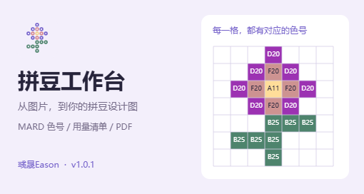

# 拼豆工作台



把喜欢的画面，一颗颗拼出来。作者：**彧晟Eason**。当前版本 **1.0.1**。

将像素图片或普通照片转换为 MARD 拼豆设计图，生成网格、色号和每色实际用量，导出可打印的 PDF、PNG 和 CSV。支持独立网页与小黑盒工坊小程序；图片在设备本地处理。

## 功能

- 导入 PNG、JPEG、WebP，保留透明区域。
- 自动尺寸、29/58/32/64/96 格预设、自定义 1–200 格。
- 等比补齐、颜色数量限制、MARD 221/291 色；后续可扩展品牌注册表。
- 网格、行列坐标、色号、每色实际数量。
- PDF 含总览、用量表和分块格子图；PNG 与 CSV 使用同一份图纸统计。
- 桌面及手机布局，动态避让顶部状态栏和底部手势区，小黑盒文件选择/保存适配。

## 开发与构建

需要 Node.js 22.20.0 或以上。所有 npm 命令在 `app/` 内执行：

```powershell
cd app
npm ci --legacy-peer-deps
npm run dev:web
```

```powershell
npm run build:web        # 独立网页：dist-web/
npm run build            # 小黑盒：dist/
npm test
npm run test:e2e         # 需要 Microsoft Edge
npm run verify:production
```

构建结果采用相对资源路径，可部署到静态网站的根目录或子目录。运行时不依赖后端、数据库或远程字体。不要直接使用 `file://` 打开。

## 小黑盒 CLI

项目固定使用官方 SDK/CLI 0.8.4。无需安装另一个全局版本：

```powershell
npm run hb-sdk -- login
npm run hb-sdk -- login status
npm run hb-sdk -- remote info
npm run dev
```

官方 Browser Mock 的 iframe 禁止下载。网页版可直接下载；真实客户端通过 SDK 保存。发布前需在所声明平台验收图片导入和 PNG/CSV/PDF 保存。

当前小黑盒平台声明为 Android；iOS、OHOS 及桌面客户端完成真机验收后再发布支持。网页版保留桌面及手机布局。

详见 [应用使用说明](app/README.md)、[发布说明](docs/releases/1.0.1.md) 和 [第三方来源与许可证](app/THIRD_PARTY_NOTICES.md)。

## 作者与反馈

署名：**彧晟Eason**。源码：[Eason4869/pindou-workbench](https://github.com/Eason4869/pindou-workbench)。问题与建议可提交 [GitHub Issue](https://github.com/Eason4869/pindou-workbench/issues)。

屏幕色值仅供参考，请以实物色卡为准。统计为实际用量，不自动增加备料余量；孔距只估算成品尺寸，PDF 不是真实底板尺寸的定位模板。
